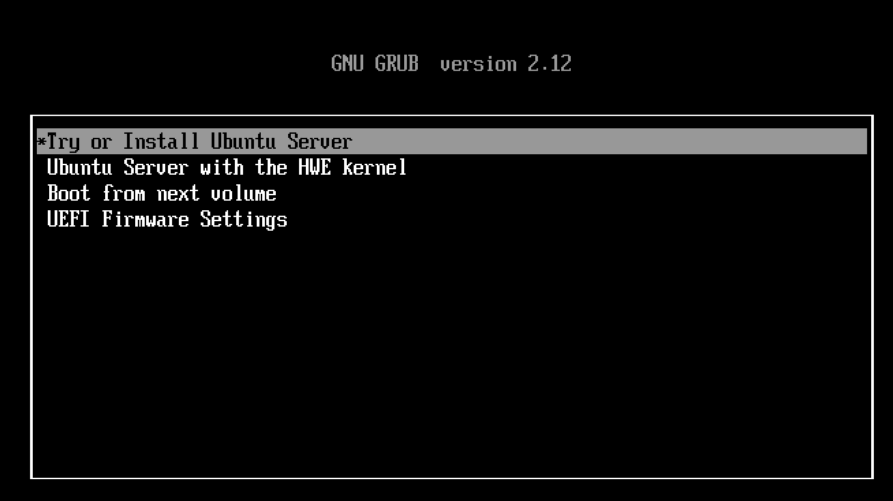

### UTM
#### Download
Download the UTM app [here](https://mac.getutm.app/). 
Download Ubuntu 24 [here](https://ubuntu.com/download/server). 
#### Configuring UTM
Next we will use the Ubuntu iso image we just downloaded to create a new Ubuntu VM

1. Open UTM and click on Create a New Virtual Machine.
2. Select Virtualize and then choose Linux.
3. Press browse and select the downloaded ARM-based ISO file.
4. Adjust hardware settings:
    * Memory: Default is 4096 MiB
    * Storage: Tested with 40 GB
5. No shared directory necessary so press Continue here
6. Name the VM (e.g., Ubuntu 24.04 LTS).
7. Click Save to create the VM.

8. Click on Run to start the installation.
9. Use arrow keys to select Try or Install Ubuntu Server. 
10. Select language (e.g., English). 
10. Choose keyboard layout 
11. For installation type, ensure Ubuntu Server is selected. 
11. Select defaults for network configuration 
12. Leave default for proxy settings 
13. Wait for Ubuntu mirror configuration tests to pass.
13. Choose storage configuration: Use entire disk. 
14. Accept defaults for filesystem and accept continuing installation. 
15. Set up profile
Your name and your server name doesn't matter
Username (your ubuntu username) password.
16. Skip enabling Ubuntu Pro
15. Choose to install OpenSSH for remote access. 
16. Accept defaults for the rest of the settings and wait for installation to be complete
17. Press Reboot Now when the option is there
18. You'll likely get a failed unmounting error . Press enter after this happens
19. Exit out of your VM and right click the list of VMs to actually stop it! [stopVM](mac_utm_imgs/stopVM.png)
20. Select CD/DVD and press clear [clear](mac_utm_imgs/clear.png), it should now be empty [empty](mac_utm_imgs/empty.png)
21. Press the play button on your VM to enter it where you will be prompted to enter your ubuntu username and password

#### Configuring SSH
The Ubuntu VM we created is pretty slow and can't run graphical applications easily, so it'll be hard to develop code here. What we will do instead is SSH into the VM we created from regular MacOS so we can develop our linux code while also being in MacOS.  

Open the Ubuntu VM and run ``` hostname -I``` This will output your Ubuntu VM's IP address to SSH into.  

Note the ip address, everything before the letters (192.168.64.8 from the image above) 

Open Visual Studio Code in MacOS. 
Install the folowing extensions from the extensions marketplace:  

1. In VSCode press ```command + shift + p```
2. Type Remote-SSH: Open SSH Configuration File
3. Select the one that's in /.ssh/config
4. This file contains all your possible SSH targets, we will add the Ubuntu VM as an SSH target. Type this into your ssh config and the IP address of your VM you got earlier.
```
Host [Name of SSH, can be anything]
HostName [IP Address]
User [Your user name]
``` 
For example mine could be: 
``` 
Host Ubuntu-UTM-VM
HostName 192.169.42.0
User laksh 
```
5. Press ```command + shift + p``` and type Remote-SSH: Connect to Host
6. Select the hostname you just added
7. Congrats! You are now SSH'd into your Ubuntu VM. 