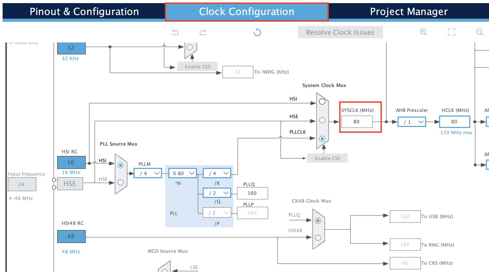
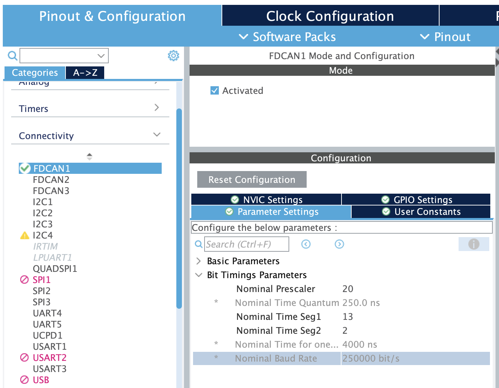
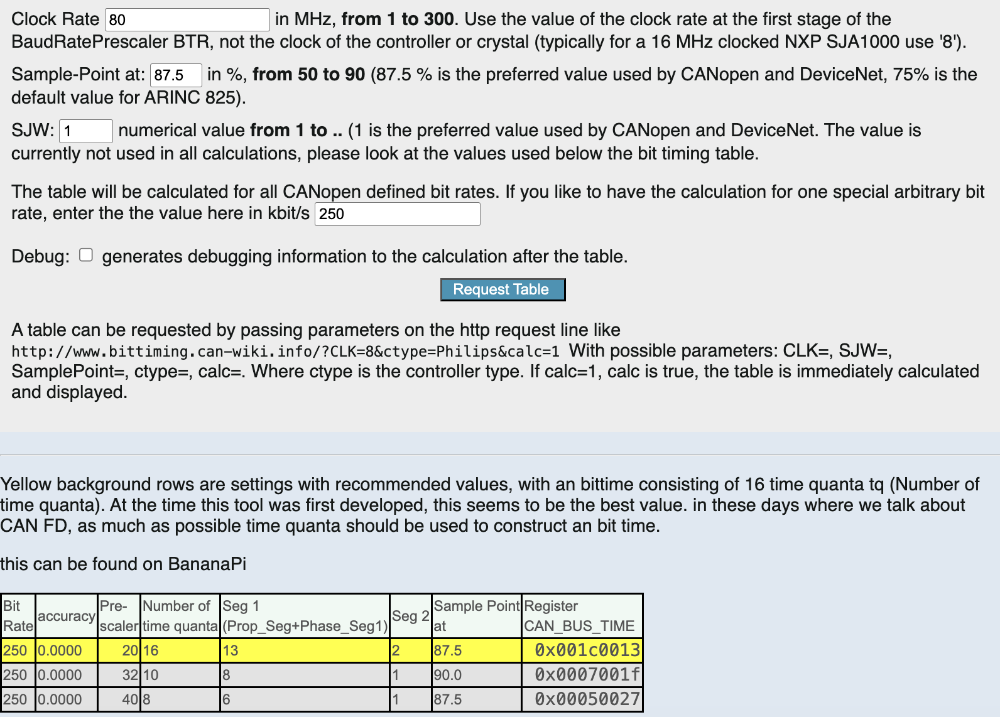

# CANbus Setup

## About CAN

### CAN FD vs bxCAN
There are two types of CAN, regular bxCAN and CAN FD. CAN FD is a variant of CAN that we can clock at a much higher frequency compared to bxCAN. The G4 series of STM32 only supports CAN FD and the F4 and L4 series only supports regular bxCAN. In order to maintain cross compatibility betwee all of our microcontrollers, we're mainly clocking our CAN at 250kpbs. CAN FD can be configured to baud rates of 1 mbps.

### CAN DBCs
A CAN DBC is a file used to store and encode CAN messages. 

## CAN Driver Structure
Functionality wise, the code for CAN FD and bxCAN are very similar, so we can have a function 

### bxCAN Driver

### CAN FD Driver

## Configuring CAN in CubeMX
Please read the [CubeMX Overview](./CubeMX.md) page first to understand how CubeMX works

### Baud rate configuration
For two devices to communicate on the same CAN bus, the baud rates of those CAN devices have to the same. 

We normally configure baud rate for 250kbps.  

In CubeMX, go to the ```Clock Configuration``` tab and make sure that the SYSCLK is 80 MHz. The SYSCLK represents the system clock of the microcontroller, and most math around how timers and baud rates are configured is based on the system clock.


Configure the CAN_TX and CAN_RX pins in ```Pinout & Configuration```

Once you've configured the pins go to ```Connectivity```, and press the FDCAN peripheral.

- Nominal Prescalar
- Nominal Time Seg1
- Nominal Time Seg2

To configure the baud rate you need to change the following properties in the ```Configuration -> Parameter Settings```
. 


You can use a calculator to calculate these time segments values given the final baud rate. [This](http://www.bittiming.can-wiki.info/) calculator works. Just enter the Clock Rate in Mhz and the bit rate in kbps.
. 
So the values I normally suggest using these values for 250kbps:

- Nominal Prescalar: 20
- Nominal Time Seg1: 13
- Nominal Time Seg2: 2

You'll see the baud rate you've configured in the ```Nominal Buad Rate``` field in bit/s. If you're configuring for 250kbps you should see 250000 bit/s.


## Configuring the CAN driver

### System Clock Config

### CAN recieve entries

### CAN filter

### CAN init
