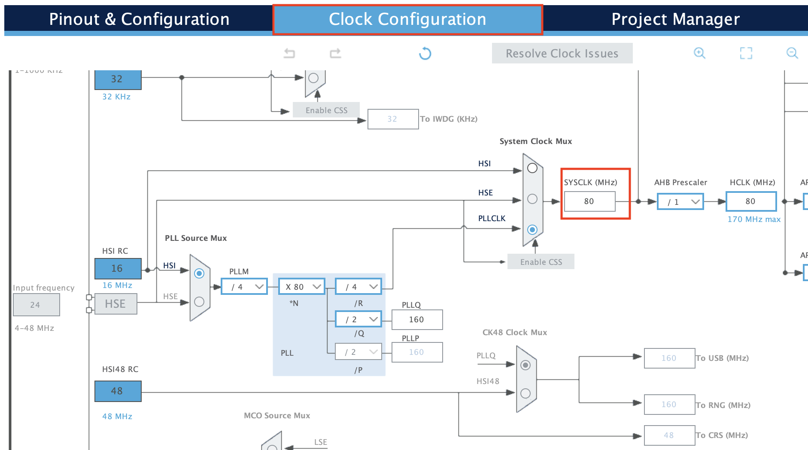
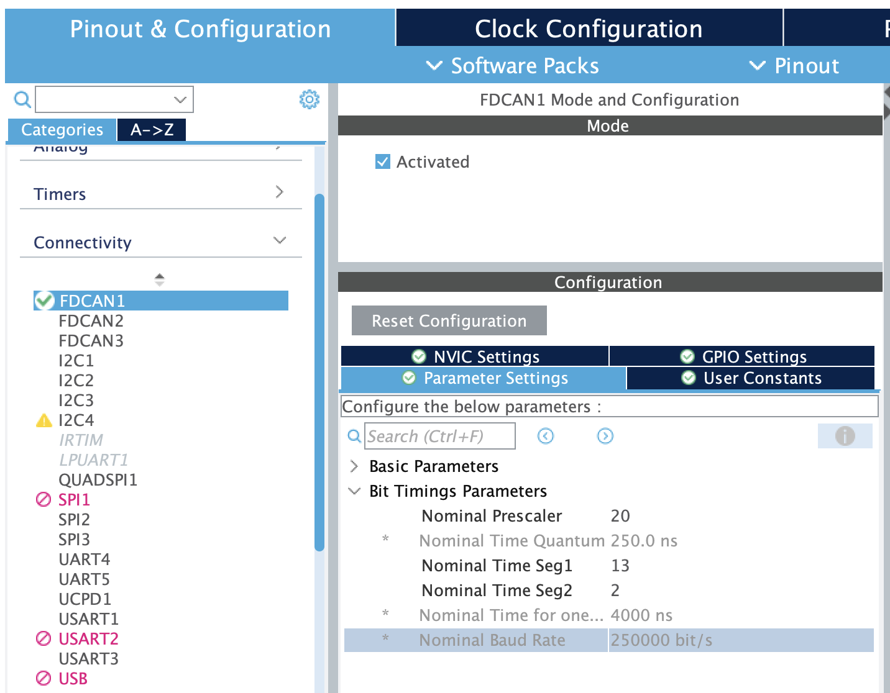
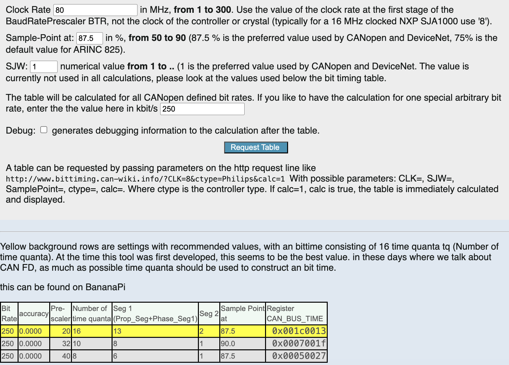

# CANbus Setup

## About CAN

### CAN FD vs bxCAN
There are two types of CAN, regular bxCAN and CAN FD. CAN FD is a variant of CAN that we can clock at a much higher frequency compared to bxCAN. The G4 series of STM32 only supports CAN FD and the F4 and L4 series only supports regular bxCAN. In order to maintain cross compatibility between all of our microcontrollers, we're mainly clocking our CAN at 250kbps. CAN FD can be configured to baud rates of 8 Mbps, while regular bxCAN can be configured up to 1 Mbps.


## Configuring CAN in CubeMX
Please read the [CubeMX Overview](./CubeMX.md) page first to understand how CubeMX works

### System Clock Config

In CubeMX, go to the ```Clock Configuration``` tab and make sure that the SYSCLK is 80 MHz. The SYSCLK represents the system clock of the microcontroller, and most math around how timers and baud rates are configured is based on the system clock.
. 

Instructions on how to do that can be found [here](./CubeMX.md) in section 3.3.

### Baud rate configuration
For two devices to communicate on the same CAN bus, the baud rates of those CAN devices have to be the same. 

We normally configure baud rate for 250kbps, but that may change depending on the specific bus, along with COTS devices (e.g. Elcon charger, steering angle sensor). For the 2026 LHRs vehicle, baud rates are defined in the [Wire Harness Design](https://utexas.sharepoint.com/:x:/r/sites/ENGR-LonghornRacing/_layouts/15/Doc.aspx?sourcedoc=%7BD8E24070-8FDC-4831-B8E9-E2DAC530E2E1%7D&file=2026%20Wire%20Harness%20Design.xlsx&action=default&mobileredirect=true) sheet.


Configure the CAN_TX and CAN_RX pins in ```Pinout & Configuration```

Once you've configured the pins go to ```Connectivity```, and press the FDCAN or CAN peripheral.

- Nominal Prescaler
- Nominal Time Seg1
- Nominal Time Seg2

To configure the baud rate you need to change the following properties in the ```Configuration -> Parameter Settings```
. 


You can use a calculator to calculate these time segments values given the final baud rate. [This](http://www.bittiming.can-wiki.info/) calculator works. Just enter the Clock Rate in Mhz and the bit rate in kbps.
. 
So I normally suggest using these values for 250kbps:

- Nominal Prescalar: 20
- Nominal Time Seg1: 13
- Nominal Time Seg2: 2

You'll see the baud rate you've configured in the ```Nominal Baud Rate``` field in bit/s. If you're configuring for 250kbps you should see 250000 bit/s.


## Configuring the CAN driver

### 1. CAN MSP Init
The CAN MSP Init function is generated by CubeMX, and it initializes the GPIO pins with the correct CAN alternate function. It is needed by to get CAN and/or CAN_FD to work. The MSP init functions are called after `HAL_CAN_Init()` is called.

For CAN_FD copy the below functions into your code:

* ```HAL_FDCAN_MspDeInit```
* ```HAL_FDCAN_MspInit``` 

For bxCAN copy the below functions into your code:

* ```HAL_CAN_MspInit```
* ```HAL_FDCAN_MspInit``` 

#### Priority Configuration
There is a max priority we can configure interrupts to be that use FreeRTOS functions. Make sure that your interrupts priority is >= this variable `configLIBRARY_MAX_SYSCALL_INTERRUPT_PRIORITY`.  

Look at the call to the NVIC Set Priority function
```sh
    # sets the FDCAN 1 interrupts to be 3 + configLIBRARY_MAX_SYSCALL_INTERRUPT_PRIORITY
    HAL_NVIC_SetPriority(FDCAN1_IT0_IRQn, configLIBRARY_MAX_SYSCALL_INTERRUPT_PRIORITY + 3, 0);
    HAL_NVIC_EnableIRQ(FDCAN1_IT0_IRQn);
    HAL_NVIC_SetPriority(FDCAN1_IT1_IRQn, configLIBRARY_MAX_SYSCALL_INTERRUPT_PRIORITY + 3, 0);
    HAL_NVIC_EnableIRQ(FDCAN1_IT1_IRQn);
```
Do the same for all the CAN peripherals for every call to ```HAL_NVIC_EnableIRQ```.

### 2. CAN Recieve Entries
In order to recieve CAN messages, you must declare the a `can[x]_recv_entries.h` header file.

The syntax is 
```c
CAN_RECV_ENTRY([ID], [number of entires in the queue], [if the queue is circular or not])

```

The queue is `circular` if when the queue is full, one of the pieces of data is overridden for the new piece of data.

```c
// this makes a non-circular fifo of size 5 for the CAN ID 0x001.
CAN_RECV_ENTRY(0x001, 5, false)
```

The file name must be `canX_recv_entries.h` where the `X` corresponds to the can peripheral. 

See the ``test/Inc`` folder for an example can recieve entries header. You MUST delcare a can recieve header for every CAN peripheral.


### 3. CAN Filter
CAN filters determine which CAN frames the hardware accepts. Frames that do not pass the filter are discarded by the peripheral before they reach the software driver.

For FDCAN, see the following [tutorial](https://controllerstech.com/fdcan-normal-mode-stm32/#fdcan-filter-configuration) on how to configure FDCAN filters.

For bxCAN, see the "Configuring CAN Filters in STM32" section in this [tutorial](https://controllerstech.com/can-protocol-in-stm32/).


### 4. CAN Init
For bxCAN, call:
```c
can_status_t can_init(CAN_HandleTypeDef* handle, CAN_FilterTypeDef* filter) 
```
```c
can_status_t can_start(CAN_HandleTypeDef* handle);
```

For FDCAN, call:
```c
can_status_t can_fd_init(FDCAN_HandleTypeDef* handle, FDCAN_FilterTypeDef* filter)
``` 
and 
```c
can_status_t can_fd_start(FDCAN_HandleTypeDef* handle);
```

Make sure the filter config and handle are both configured before calling the init function.
See the `can_fd` test in the `test/tests/` folder. The tests are both configured for `INTERNAL_LOOPBACK` mode which connects TX and RX each other. You should set it to `NORMAL` during production code.

## Sending CAN messages
Please read the following sections on DBC files and how to use them before moving on.

* CAN Messages
    * [Editing DBC Files](dbcEditor.md)
    * [Generating DBC Headers](usingDBCs.md)

Both the bxCAN and CAN_FD have the same arguments to send CAN data (differences are only in name).

The ```FDCAN_TxHeaderTypeDef``` and ```CAN_TxHeaderTypeDef``` defined in the STM32 HAL, are different mostly in name, and they contain important information like length of the CAN message, CAN ID, and other paramters. See the relevant test files on examples on what to set those parameters as.

```c
can_status_t can_fd_send(FDCAN_HandleTypeDef* handle, FDCAN_TxHeaderTypeDef* header, uint8_t data[], TickType_t delay_ticks)
```
```c

can_status_t can_send(CAN_HandleTypeDef* handle, const CAN_TxHeaderTypeDef* header, const uint8_t data[], TickType_t delay_ticks)
```


## Recieving CAN messages
Please read the following sections on DBC files and how to use them before moving on.

* CAN Messages
    * [Editing DBC Files](dbcEditor.md)
    * [Generating DBC Headers](usingDBCs.md)


Both the bxCAN and CAN_FD have the same arguments to recieve CAN data (differences are only in name).

In order to recieve CAN messages, you must have that ID in the ``can[X]_recv_entries.h` header file. The CAN ID must also be accepted by the CAN hardware filter, or the CAN recieve interrupt won't trigger. 

```c
can_status_t can_fd_recv(FDCAN_HandleTypeDef* handle, uint16_t id, FDCAN_RxHeaderTypeDef* header, uint8_t data[], TickType_t delay_ticks)
```

```c
can_status_t can_recv(CAN_HandleTypeDef* handle, uint16_t id, CAN_RxHeaderTypeDef* header, uint8_t data[], TickType_t delay_ticks)
```

## Blocking on multiple CAN messages
If you want a thread to block on multiple CAN messages, and wake up the thread if any of those CAN messages are sent, you can use a [FreeRTOS queue set](https://freertos.org/Documentation/02-Kernel/02-Kernel-features/10-Blocking-on-multiple-RTOS-objects). Both the bxCAN and FDCAN have built in support to pass a list of IDs + preallocated queue set.

### Creating the Queue Set
```c
typedef struct
{
    const uint32_t *ids; // list of IDs in the queue set
    uint32_t id_count; // number of IDs in the queue set
    QueueSetHandle_t queueSet; // the queue set
} can_id_set_t;
```
This `can_id_set_t` struct contains all necessary metadata to block on mutliple CAN IDs. This struct will be created by the user, and must be statically allocated. It's best practice to make the max size of the queueSet, the summation of all the max lengths of the queues in the thread.

### Register the Queue Set
Once the queue set is created, pass in the set to the CAN driver to add the CAN driver's internal per-ID queue to the queue set. 
#### bxCAN
```c
can_status_t can_register_id_set(CAN_HandleTypeDef* handle, can_id_set_t* set)
```
#### FDCAN
```c
can_status_t can_fd_register_id_set(FDCAN_HandleTypeDef* handle, can_id_set_t* set)
```

### Recieve CAN data from the Queue Set
Once the queue set has registered IDs, pass in the can handle, the list of IDs, a pointer to the ID, and the blocking time. If the function returns successfully, there is a CAN ID that has a new message, and that is passed by reference through the id variable.
#### bxCAN
```c
can_status_t can_recv_set(CAN_HandleTypeDef* handle, can_id_set_t* set, uint16_t *id, TickType_t delay_ticks)
```
#### FDCAN
```c
can_status_t can_fd_recv_set(FDCAN_HandleTypeDef* handle, can_id_set_t* set, uint16_t *id, TickType_t delay_ticks)
```
Usage example:
```c
    if (can_fd_recv_set(hfdcan1, &canQueueSetStruct, &id, portMAX_DELAY) == CAN_OK)
    {
        can_fd_recv(hfdcan1, id, &fdcan1_rx_header, fdcan1_rx_data, 0);
        
        printf("Recieved Can message from id: %d\n\r", id);

        HAL_GPIO_TogglePin(LED_PORT, LED_PIN);
    }
```
#### Tests that use queue sets
* [bxCAN](https://github.com/lhr-solar/Embedded-Sharepoint/blob/main/test/tests/can_queueSet_test.c)
* [FDCAN](https://github.com/lhr-solar/Embedded-Sharepoint/blob/main/test/tests/can_fd_queueSet_test.c)

## CAN hooks
Two hook functions are provided to the user for when a CAN message is sent and when a CAN message is recieved. These hooks are useful for debugging and mirroring CAN messages over USB. By default, they are defined as `weak` in the driver file, which allows the user to redeclare it in their code, and have their implementation get called.

### Transmit Hook
The CAN transmit hook is not called from an interrupt, so you do not need to use the ISR-safe FreeRTOS functions, but blocking prevents other CAN messages from being sent, and using global variables in the hook may cause race conditions. 
#### FDCAN TX Hook
```c
can_fd_tx_callback_hook(FDCAN_HandleTypeDef* hfdcan, const can_tx_payload_t* payload)
```
#### bxCAN TX Hook
```c
void can_tx_callback_hook(CAN_HandleTypeDef* hcan, const can_tx_payload_t* payload);
```

### Recieve Hook
The CAN recieve hook is called in the context of the can recieve interrupt, so special care must be taken to not block and only use ISR-safe FreeRTOS functions like ```xQueueSendFromISR```.
#### FDCAN RX Hook
```c
void can_fd_rx_callback_hook(FDCAN_HandleTypeDef *hfdcan, uint32_t RxFifo0ITs, can_rx_payload_t recv_payload )
```
#### bxCAN RX Hook
```c
void can_rx_callback_hook(CAN_HandleTypeDef *hcan, uint32_t RxFifo0ITs, can_rx_payload_t recv_payload )
```

### Usage example:
* [Mirroring CAN RX data over USB](https://github.com/lhr-solar/PS-VehicleControlUnit/blob/main/Firmware/Tasks/Src/MotorTelemetryTask.c)


## Codebases that use CAN
* [VCU](https://github.com/lhr-solar/PS-VehicleControlUnit/blob/main/Firmware/Drivers/Src/CANbus.c)
* [Amperes](https://github.com/lhr-solar/PS-Amperes/blob/main/Firmware/Drivers/Src/AmperesCAN.c)