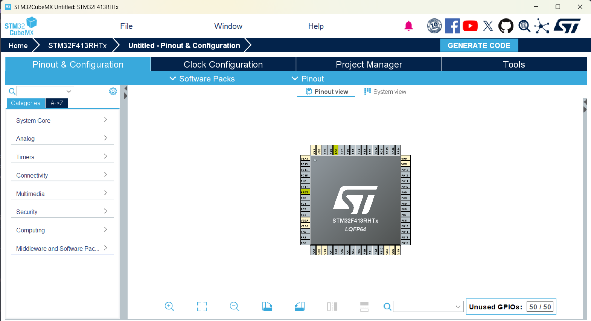
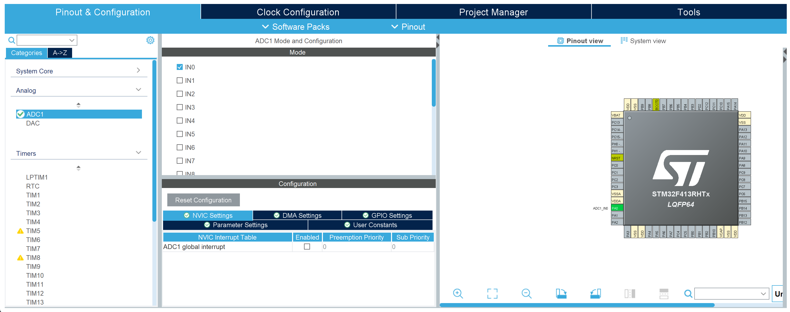
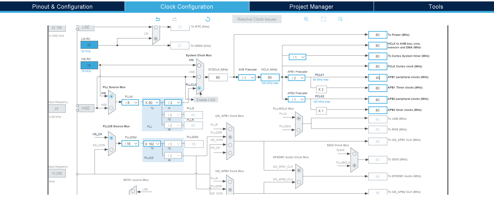

# CubeMX
STM32 CubeMX is a graphical tool made by STMicro to help in creating STM32 hardware and software. While the generated code is not always optimal, CubeMX is extremely useful for figuring out pin alternate functions, setting up clock trees, and quickly enabling peripherals.

## 1. Installing CubeMX
Download CubeMX [here](https://www.st.com/en/development-tools/stm32cubemx.html).

## 2. Using the CubeMX Microcontroller Editor
1. Open **"STM32CubeMX"**.  
2. Press **"Access to MCU Selector"**.  
3. Search for your MCU part number (e.g. **STM32F413RHT**)
4. Click **"Start Project"** and CubeMX will generate a project workspace.

|  | 
|:--:| 
| ***Note**: This is the configuration view for the STM32F413RHT so your pinout might look slightly different.* |

## 3. Editing Peripheral Settings
This section will show you how to change configurations for peripherals you wish to interface.

### 3.1 Selecting a Peripheral
- On the left-hand side of CubeMX, locate the pane with the **"Categories"** tab selected.
- Toggle the dropdowns to see the peripherals that are supported on your MCU:

> **Analog** - _ADCs, DACs_  
> **Timers** - _TIM1, TIM2, ..._   
> **Connectivity** - _I²C, USART / UART, SPI_  

- Now, you can select the peripherals you want to enable (e.g., **USART1**, **I2C1**, **TIM2**, etc.).  
- CubeMX will automatically assign the required pins on the microcontroller diagram.  
- If there are conflicts (e.g., two peripherals trying to use the same pin), CubeMX will show a warning and let you reassign pins manually.  
- Hover over the microcontroller diagram and click on a pin to change its function or remap it.

|   | 
|:--:| 
| Yay, we can configure our peripherals now! |

### 3.2 Configuring a Peripheral
- Clicking a specific peripheral opens a settings window for that peripheral.  
- The **"Mode"** and **"Configuration"** windows can be used to change configurations for a specific peripheral

- Examples of configurations:  
  &nbsp;&nbsp;-  **USART:** baud rate, word length, stop bits, parity, DMA options  
  &nbsp;&nbsp;-  **Timers:** PWM mode, clock source, prescaler values, channel mappings  
  &nbsp;&nbsp;-  **ADC:** resolution, sampling time, number of channels, trigger source

- You can also configure **NVIC interrupts** and enable/disable them from this window.

### 3.3 Clock Configuration
- Go to the **"Clock Configuration"** tab.  
- Set up the input oscillator (HSI, HSE, LSE) and PLL settings.  
- To change derived clock speeds enter your desired value and CubeMX **will calculate** the necessary prescalers to get there.
- If you exceed limits, CubeMX will flag the error in red.

|   | 
|:--:| 
| ⏰⏰⏰ |

## 4. Generating Code
1. Press the **"Project Manager"** tab.  
2. Under **"Code Generator"** you can specify project name, location, and toolchain (e.g., STM32CubeIDE, Keil, IAR, or Makefile).  
4. Click **"Generate Code"** (you may have to install firmware packages for the MCU 😴).  
5. Open the generated project in your chosen IDE and enjoy!

---
