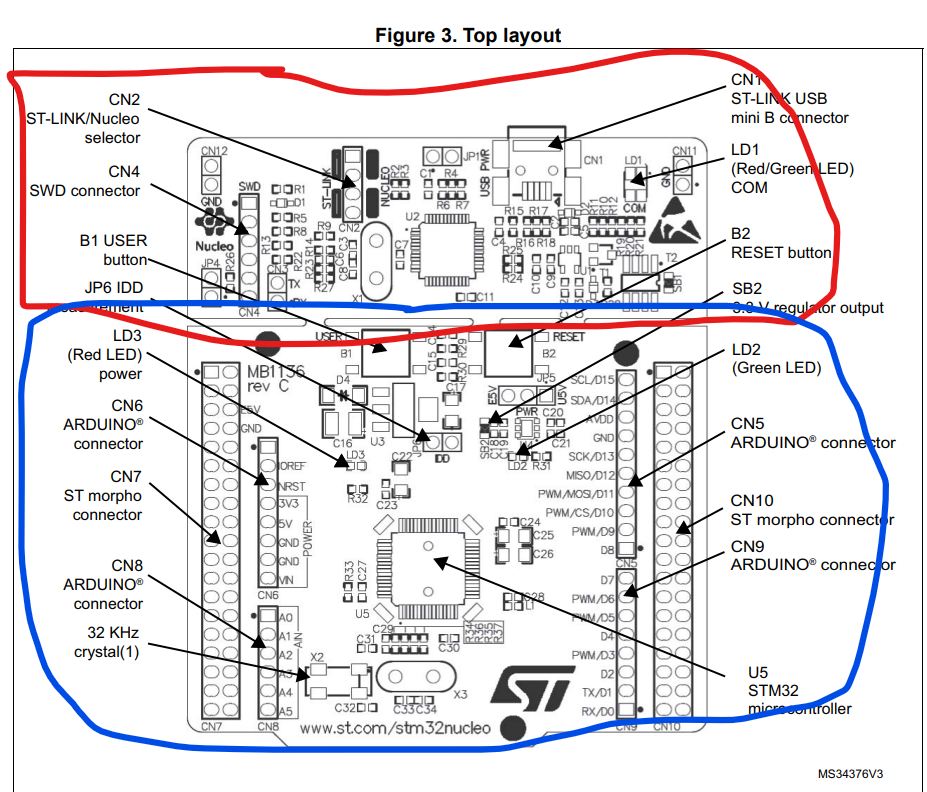
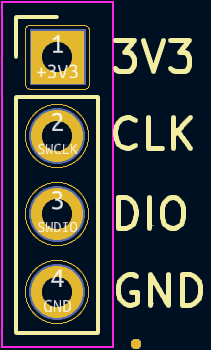
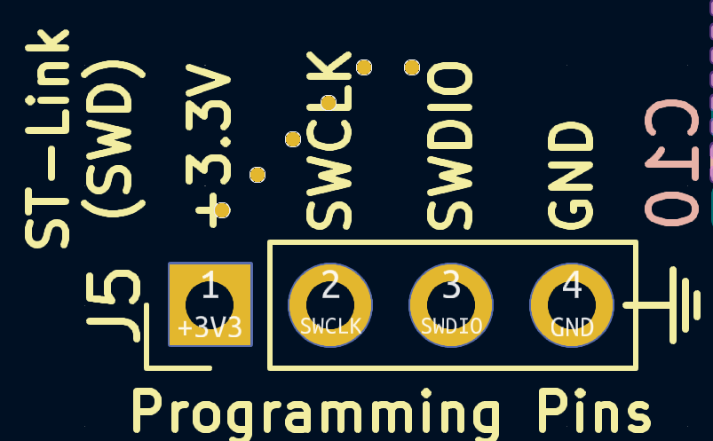
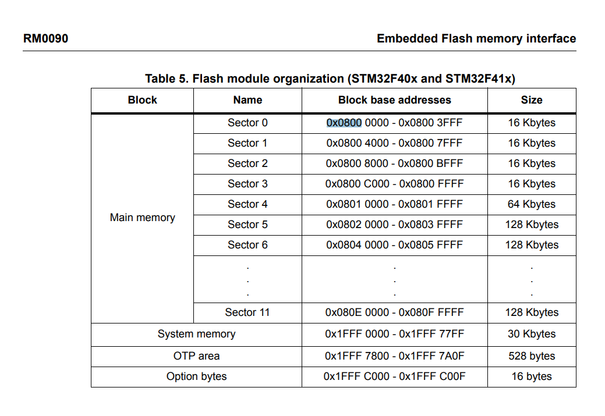
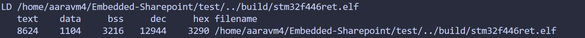

# Flashing and Debugging on an MCU

This page will walk you through how you can flash your C code on an MCU using Embedded Sharepoint!

... and also debug it 🫠

> ℹ️ **Prerequisite :** 
> Make sure you've [added Embedded Sharepoint](SharepointSubmodule.md).

## Attaching USB devices in WSL

When you plug in your STM32 device, it won't automatically get recognized by your WSL

To attach a USB device on WSL you need to install [`usbipd-win`](https://github.com/dorssel/usbipd-win/releases).

1. Install WinGet if you haven't already using these [instructions](https://learn.microsoft.com/en-us/windows/package-manager/winget/)
2. Open your powershell in administrator mode
3. Run `winget install --interactive --exact dorssel.usbipd-win`

Once we have `usbipd` we can bind and attach USB devices.

1. Open Powershell and **"Run as Administrator"**.
2. Run `usbipd list` to get a list of all USB buses.
3. Locate the device called "**ST-Link Debug**" and note the **"BUSID"** (usually in the format of number-number ).
4. Run `usbipd bind --busid <BUSID>`.
5. Run `usbipd attach --wsl --busid <BUSID>` (**must have an instance of WSL running**).

And you're good!

Confirm that your device is shared to WSL by running `lsusb` in your WSL terminal.  

## Attach USB devices using USBIPD extension
If you're using VSCode then you can use the `USBIPD Connect` extension to streamline the process.

Once the extension is installed you should see an `Attach` button at the bottom of your VSCode that when pressed will show you all USB devices. You can now press the ST-Link USB device to connect to it. 

Note: The extension only works with ST-Links/Nucleos that you’ve previously connected. If you want to use a new device, you’ll need to go through the full manual usbipd setup first. Once a device has been connected manually, the extension can be used to reconnect it quickly in the future.

## Hardware Interface

**Serial Wire Debug** (SWD) is a two-wire protocol that is an alternative to JTAG. JTAG is the most common interface for debugging/accessing MCU registers, but it requires 4 pins to communicate while SWD only requires 2, so many ARM microcontrollers will use SWD to ease pin requirements.

To program the STM32 microcontroller with SWD, we use an **ST-Link**—a tool from STMicroelectronics that runs dedicated firmware designed to program STM32 devices.

If you take a look at your STM32 Nucleo you should notice **two** sections on the board:

    Red ST-Link for Debugging
    Blue STM32 MCU and Peripherals

### ST-Link Connector

Your board may have the jumpers ON or OFF on the ST-Link Connector (**CN2**).

**ON** - you are programming the **INTERNAL** STM32 MCU (Nucleo)

**OFF** - you are programming the **EXTERNAL** STM32 MCU (Solar Board)

Decide whether you need jumpers based on which MCU you are trying to program.

> ℹ️ If you're unsure, run `st-info --probe` to see the MCU you're flashing to.

### SWD Connector

When programming an **external** MCU (not on the Nucleo) the 6-pin SWD connector (CN4) on the ST-Link will be used. 

Here's the pinout for reference

| Pin | CN4  | Designation                |
|-----|------|---------------------------|
| 1   | VDD_TARGET | VDD from application     |
| 2   | SWCLK      | SWD clock               |
| 3   | GND        | Ground                  |
| 4   | SWDIO      | SWD data I/O            |
| 5   | NRST       | RESET of target STM32   |
| 6   | SWO        | Reserved                |

On our solar boards we have a SWD interface that looks like this

    
    

After connecting the corresponding pins you'll be able to program the MCU on your board.

## Software Tooling

### Overview

The OpenOCD and stlink packages are some software tools we use to flash and debug code on our board. They are two different options for doing the same thing (flashing and debugging via JTAG/SWD).

- [**stlink**](https://github.com/stlink-org/stlink) is a software package developed by STMicroelectronics to interface with an ST-LINK device for programming and debugging purposes.

- [**OpenOCD**](https://pfeerick.github.io/InfiniTime/doc/openOCD.html) runs a GDB server, which allows us to debug remote targets via GDB. It also lets us write to flash with some extra configuration.

We currently use the OpenOCD GDB server for debugging while using `st-flash`, a tool in the stlink package for flashing code.

### Implementation

Embedded Sharepoint contains Makefiles to simplify the process of flashing code on an MCU. These Makefiles directly call the `st-flash` command.

On an STM32 MCU, flash memory starts at `0x8000000`.

After the Makefile compiles your source code into a binary (`.bin`), it writes to flash using

<pre> st-flash write $(BUILD_DIR)/$(TARGET).bin 0x8000000 </pre>

**NOTE**: We're not flashing the `.elf` file because it contains unnecessary debug symbols that we don't need to simply flash.

### Make Executables

You can use the Makefile from the `test/` directory to flash files within the `tests/` directory.

1. Navigate to the `test/` directory.

2. If you've set the environment variables mentioned in "[Adding Embedded Sharepoint](SharepointSubmodule.md)" then you can run `make TEST=<testfile>` where `tests/testfile.c` is your test.

3. After your code has been compiled and linked you should see information regarding the `.elf` file created.

If you don't see a similar message nor a `.elf` file in the `build/` directory, then look at your console output for a specific error traceback.

### Flash

If you ran the previous section without error then you should have a `.bin` and a `.elf` in your `build/` corresponding to your target MCU.

To flash

1. Navigate to `test/`
2. Run `make flash`

... and you've flashed to the MCU!

### Debug

#### GDB

To debug we'll use **OpenOCD**. 

1. Navigate to the root directory of Embedded Sharepoint.
2. Run `openocd -f openocd-stm32f4x.cfg` if you're programming an F4 MCU or the corresponding `..l4x.cfg` if you're programming an L4.
3. You should see a message that a GDB server was started on port `3333`.

Open a second terminal session to use GDB

1. Run `gdb-multiarch build/(TARGET).elf`. If you aren't in root the filepath will look slightly different.
2. Verify that GDB is using the debug symbols from the `.elf` file.
3. Run `tar extended-remote :3333` to connect to the OpenOCD GDB server.

Step through your code in GDB to analyze execution!

#### Serial Monitoring

Another debugging option is serial monitoring. The `printf` method is integrated into Embedded-Sharepoint.

1. The `HAL_UART_MspGPIOInit()` function must be implemented with the proper GPIO initialization (RCC_CLK_ENABLE, GPIO struct filled in, HAL_GPIO_Init called).

2. The `UART_HandleTypeDef` struct must be initialized with the proper settings before calling printf_init.

3. Run `printf_init(UART_HandleTypeDef)` with your desired UART to output to. For a Nucleo, this will be specified in the Nucleo user manual which you can find online. For one of our PCBs, check the schematic to see which UART peripheral your USB is connected to. 
- `printf_init` must be run after the RTOS is initialized.

4. Run `printf(...)` with your desired [format](https://www.geeksforgeeks.org/c/printf-in-c/)!

To view the output, open up an application like [PuTTY](https://www.chiark.greenend.org.uk/~sgtatham/putty/latest.html) or [picocom](https://github.com/npat-efault/picocom).

- For PuTTY, click Serial and enter your desired COM port. This should show up on your device manager (for Mac or Linux, run `lsusb`). Set the baud rate to what you configured the UART for. Hit the big open button at the bottom.
- For picocom, type in `picocom -b <baud-rate> <tty-name>` and you should be set.

