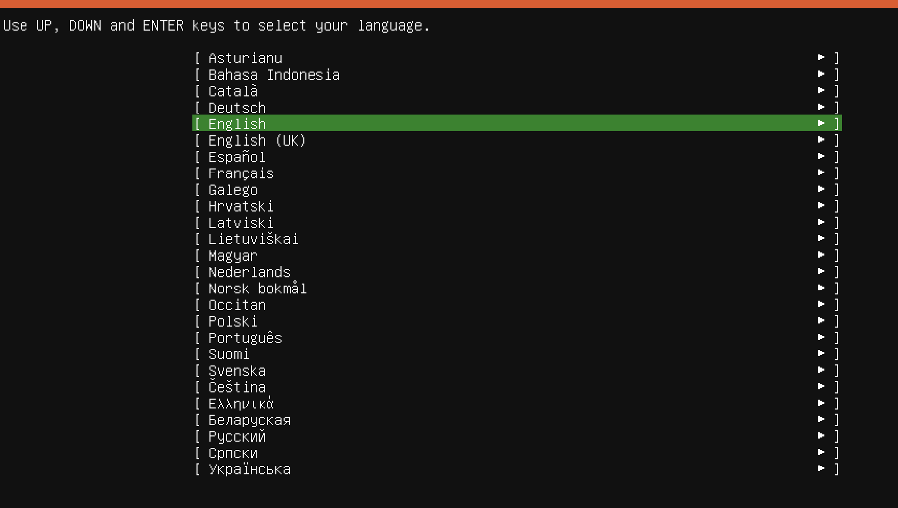
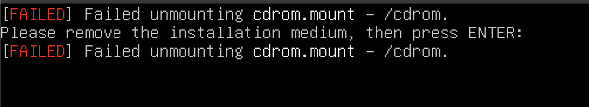

# Installation Instructions
Development for Embedded-Sharepoint requires a linux-based environment. Running linux natively yields the best results, but there are workarounds through UTM virtual machine on Mac OS or Windows Subsystem for Linux (WSL) on Windows.  

Please ensure you've done the following before moving on:  
Install [Visual Studio Code](https://code.visualstudio.com/)

## Linux
Thanks for making our lives easy :)    

1. Follow the instructions here to create your github SSH key
2. Run the steps in [Nix](#nix) next

## Windows
### Windows Subsystem for Linux (WSL)
Windows Subsystem for Linux allows you to run a linux terminal on your windows machine. We specifically use WSL2 since it allows USB passthrough for flashing our microcontrollers.  
To install WSL follow this [guide](https://learn.microsoft.com/en-us/windows/wsl/install). Make sure to install WSL2 and not WSL1.  
It will take time to fully install it, but once installed you can open WSL and it will ask you to create a username and password.
### USBIPD
In order to see a USB device in WSL, we need to pass access of a USB device from windows to WSL. You can do this through USBIPD.  
In an administrator Powershell terminal run:
```
winget install usbipd
```

Run the steps in [Nix](#nix) next

## Mac
To develop on a Mac we will use UTM, which is an apple application to emulate other operating systems. The following instructions have been tested on an M2 Macbook.
### UTM
#### Download
Download the UTM app [here](https://mac.getutm.app/). 
Download Ubuntu 24 [here](https://ubuntu.com/download/server). 
#### Configuring UTM
Next we will use the Ubuntu iso image we just downloaded to create a new Ubuntu VM

1. Open UTM and click on Create a New Virtual Machine.
2. Select Virtualize and then choose Linux.
3. Press browse and select the downloaded ARM-based ISO file.
4. Adjust hardware settings:
    * Memory: Default is 4096 MiB
    * Storage: Tested with 40 GB
5. No shared directory necessary so press Continue here
6. Name the VM (e.g., Ubuntu 24.04 LTS).
7. Click Save to create the VM.

8. Click on Run to start the installation.
9. Use arrow keys to select Try or Install Ubuntu Server. 
10. Select language (e.g., English). 
10. Choose keyboard layout 
11. For installation type, ensure Ubuntu Server is selected. 
11. Select defaults for network configuration 
12. Leave default for proxy settings 
13. Wait for Ubuntu mirror configuration tests to pass.
13. Choose storage configuration: Use entire disk. 
14. Accept defaults for filesystem and accept continuing installation. 
15. Set up profile
Your name and your server name doesn't matter
Username (your ubuntu username) password.
16. Skip enabling Ubuntu Pro
15. Choose to install OpenSSH for remote access. 
16. Accept defaults for the rest of the settings and wait for installation to be complete
17. Press Reboot Now when the option is there
18. You'll likely get a failed unmounting error . Press enter after this happens
19. Exit out of your VM and right click the list of VMs to actually stop it! [stopVM](mac_utm_imgs/stopVM.png)
20. Select CD/DVD and press clear [clear](mac_utm_imgs/clear.png), it should now be empty [empty](mac_utm_imgs/empty.png)
21. Press the play button on your VM to enter it where you will be prompted to enter your ubuntu username and password

#### Configuring SSH
The Ubuntu VM we created is pretty slow and can't run graphical applications easily, so it'll be hard to develop code here. What we will do instead is SSH into the VM we created from regular MacOS so we can develop our linux code while also being in MacOS.  

Open the Ubuntu VM and run ``` hostname -I``` This will output your Ubuntu VM's IP address to SSH into.  

Note the ip address, everything before the letters (192.168.64.8 from the image above) 

Open Visual Studio Code in MacOS. 
Install the folowing extensions from the extensions marketplace:  

1. In VSCode press ```command + shift + p```
2. Type Remote-SSH: Open SSH Configuration File
3. Select the one that's in /.ssh/config
4. This file contains all your possible SSH targets, we will add the Ubuntu VM as an SSH target. Type this into your ssh config and the IP address of your VM you got earlier.
```
Host [Name of SSH, can be anything]
HostName [IP Address]
User [Your user name]
``` 
For example mine could be: 
``` 
Host Ubuntu-UTM-VM
HostName 192.169.42.0
User laksh 
```
5. Press ```command + shift + p``` and type Remote-SSH: Connect to Host
6. Select the hostname you just added
7. Congrats! You are now SSH'd into your Ubuntu VM. 

You need to rerun the github SSH key setups in your linux VM. 

Run the steps in [Nix](#nix) next

## Nix
Nix is a package manger that lets you write out all the packages you want to install in a human readable format. This simplifies development since I can write out a list of dependencies needed to compile.  
Open Embedded-Sharepoint in your linux environment, and run the following commands in the terminal: 
Make the nix_install script runnable
```
chmod +x ./nix_install.sh
```
Run the script to install the needed nix dependencies
```
./nix_install.sh
```
Enter the nix shell and download dependencies for Embedded-Sharepoint
```
nix develop
```
In this nix shell all the dependencies needed for Embedded-Sharepoint should be installed, anytime you want to develop code you will need to run nix develop.  
Test if installation is succesful by compiling a test 
```
cd test
make TEST=blinky
```