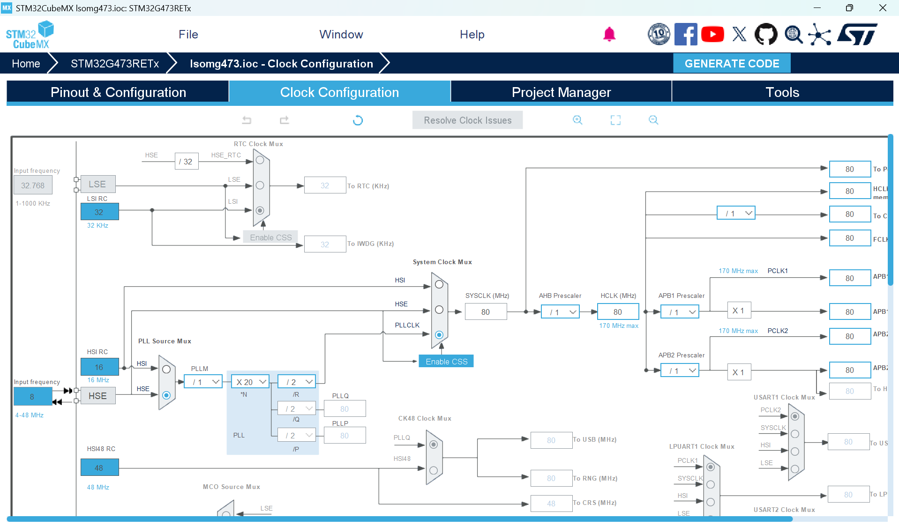
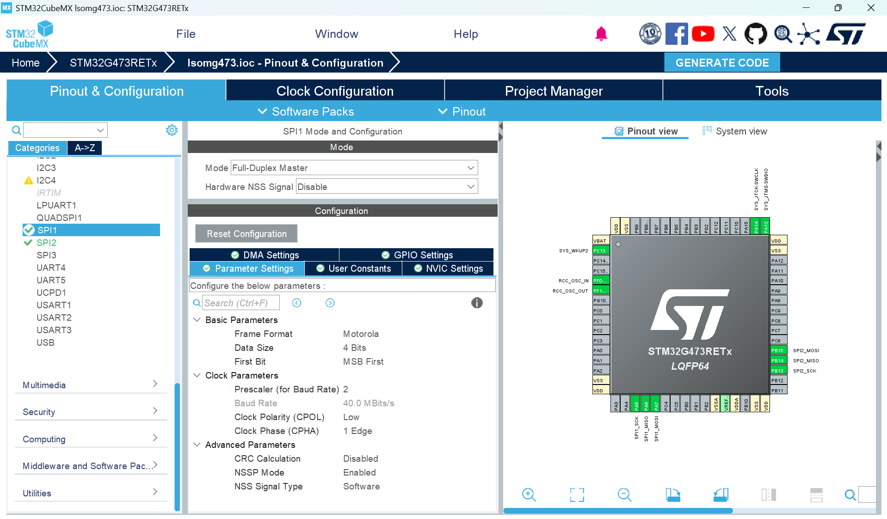

# SD Card Driver Documentation

## Overview

The Leader System-On-Module (LSOM) used on several critical boards on the car features a **SPI-based SD card reader** connected to the STM32 microcontroller. This driver provides a **thread-safe, robust interface** to interact with this hardware using **interrupt-driven SPI** and **FreeRTOS** synchronization primitives. By integrating with **FatFs**, the driver enables full file system capabilities via a background worker task, ensuring high-latency file I/O does not impede time-critical application logic.

---

## Minimal Working Example

> [!WARNING]
> This driver relies on the FreeRTOS scheduler. Do not call these functions before `vTaskStartScheduler()` as it will result in a mutex deadlock or system crash.

```c
#include "stm32xx_hal.h"
#include "sdcard.h"
#include <string.h>

// FreeRTOS includes
#include "FreeRTOS.h"
#include "task.h"

/* 1. Global Handles & Hardware Structures */
sd_handle_t sd_lsom;
SPI_HandleTypeDef hspi_user; 

/* 2. Static Task memory allocation */
StaticTask_t xInitTaskBuffer;
StackType_t xInitTaskStack[1024]; 

StaticTask_t xLogTaskBuffer;
StackType_t xLogTaskStack[1024];

/**
 * @brief Initialization Task
 * Only call USER_SD_Card_Init from ONE task 
 * It ensures the SD card is 100% ready before it ever allows the other tasks to start sending data
 */
void Init_Task(void* argument) {
    /* Link hardware-specific pins and SPI instance to the handle */
    sd_lsom.hspi = &hspi_user;
    sd_lsom.cs_port = USER_CS_PORT; 
    sd_lsom.cs_pin = USER_CS_PIN;

    /* Initialize Driver & Worker Task (Priority 3) */
    /* This creates the SD_Worker task and the internal job queue */
    if (USER_SD_Card_Init(&sd_lsom, tskIDLE_PRIORITY + 3) != SD_OK) {
        // Handle Init Error (e.g., blink an error LED)
        while(1);
    }

    /* Task has finished setup, so it deletes itself */
    vTaskDelete(NULL);
}

/**
 * @brief Logging Task
 * Formats string data and pushes it into a circular job queue to be processed by a background worker task.
 */
void Logging_Task(void* argument) {
    char *log_msg = "LSOM_SYSTEM_OK\r\n";

    for(;;) {
        /* Asynchronous Write: Queues data for the background worker */
        /* If the queue is full, the oldest entry is dropped */
        USER_SD_Card_Write_Async(&sd_lsom, "LOG.TXT", log_msg, pdMS_TO_TICKS(10));

        /* Sleep for 500ms to yield CPU to other tasks */
        vTaskDelay(pdMS_TO_TICKS(500));
    }
}

int main(void) {
    /* Standard STM32 HAL & Hardware Initializations */
    HAL_Init();
    SystemClock_Config();
    User_Hardware_Init(); // Must configure SPI Pins and NVIC

    /* 3. Create Tasks using Static Memory */
    xTaskCreateStatic(Init_Task, "Init", 1024, NULL, tskIDLE_PRIORITY + 2, xInitTaskStack, &xInitTaskBuffer);
    xTaskCreateStatic(Logging_Task, "Log", 1024, NULL, tskIDLE_PRIORITY + 1, xLogTaskStack, &xLogTaskBuffer);

    /* 4. Start the Multitasking Scheduler */
    vTaskStartScheduler();

    while (1); // Should never reach here
}

/**
 * @brief Required HAL SPI Callbacks
 * These are essential for waking the worker task after hardware transfers.
 */
void HAL_SPI_TxRxCpltCallback(SPI_HandleTypeDef *hspi) {
    BaseType_t xHigherPriorityTaskWoken = pdFALSE;
    sdcard_SPI_TxRxCpltCallback(hspi, &xHigherPriorityTaskWoken);
    portYIELD_FROM_ISR(xHigherPriorityTaskWoken);
}

```

---

## Required Hardware Setup

### CubeMX Configuration
To ensure reliable SD card operation on the **LSOM**, configure the **STM32CubeMX Clock Configuration** as shown below:

* **PLL Source:** Set to **HSE (External Crystal)**.
* **HCLK Frequency:** Set to **80 MHz**.



### SPI Peripheral Settings
Configure your SPI instance (e.g., SPI1) to match these settings for the SD card interface:



### MCU Requirements

Your board must have:

* An STM32 MCU using **STM32 HAL** (ex. LSOM).
* A configured **SPI peripheral** (Interrupt-driven).
* **FreeRTOS enabled** in the project.

### Required HAL Callbacks

You **must** forward the SPI callbacks in your `main.c` or interrupt file. Failure to do so will cause the driver to block forever during data transfers.

```c
void HAL_SPI_TxRxCpltCallback(SPI_HandleTypeDef *hspi) {
    BaseType_t xHigherPriorityTaskWoken = pdFALSE;
    sdcard_SPI_TxRxCpltCallback(hspi, &xHigherPriorityTaskWoken);
    portYIELD_FROM_ISR(xHigherPriorityTaskWoken);
}

void HAL_SPI_RxCpltCallback(SPI_HandleTypeDef *hspi) { HAL_SPI_TxRxCpltCallback(hspi); }
void HAL_SPI_TxCpltCallback(SPI_HandleTypeDef *hspi) { HAL_SPI_TxRxCpltCallback(hspi); }

```

---

## Initialization Process

### Driver Initialization

The `USER_SD_Card_Init` function must be called exactly once from an RTOS task.

```c
USER_SD_Card_Init(&sd_lsom, tskIDLE_PRIORITY + 3);

```

**Internal Operations:**

* **Mutex Creation:** Creates a static mutex to prevent SPI bus contention between tasks.
* **Semaphore Creation:** Creates a binary semaphore for ISR-to-task synchronization.
* **Worker Spawn:** Starts the `SD_Worker` task to handle background file I/O.
* **FatFs Init:** Initializes the FatFs middle layer for file system access.

---

## Operating Modes

### Thread-Safe Synchronous IO

Used for direct block access. These functions acquire the mutex, perform the SPI transfer, and release the lock.

* **Read Block:** `SD_ReadSingleBlock(&sd_lsom, blockNum, buffer, timeout);`
* **Write Block:** `SD_WriteSingleBlock(&sd_lsom, blockNum, buffer, timeout);`

### Asynchronous Logging (Recommended)

Prevents file I/O from blocking high-priority control loops.

* **Function:** `USER_SD_Card_Write_Async(&sd_lsom, "DATA.TXT", "Example", delay);`
* **Circular Buffer:** Uses `xQueueSendCircularBuffer` to drop the oldest queued job if the SD card is missing or the queue is full.

---

## API Summary

| Purpose | Function |
| --- | --- |
| Driver/Worker Setup | `USER_SD_Card_Init()` |
| Non-blocking Append | `USER_SD_Card_Write_Async()` |
| Raw Block Read | `SD_ReadSingleBlock()` |
| Raw Block Write | `SD_WriteSingleBlock()` |

---

## Common Pitfalls

### SD Card Removal

If the card is removed, the `SD_Worker` task will attempt to re-initialize every 500ms. Telemetry tasks will not block; they will drop the oldest data once the job queue is saturated.

### Interrupt Priorities

The SPI IRQ priority must be numerically greater than configLIBRARY_MAX_SYSCALL_INTERRUPT_PRIORITY (defined in FreeRTOSConfig.h) to be compatible with FreeRTOS API calls from the ISR.

### Stack Usage

The `SD_Worker` task is allocated **2048 words**. Large local buffers in file operations should be avoided to prevent stack overflows.

---

